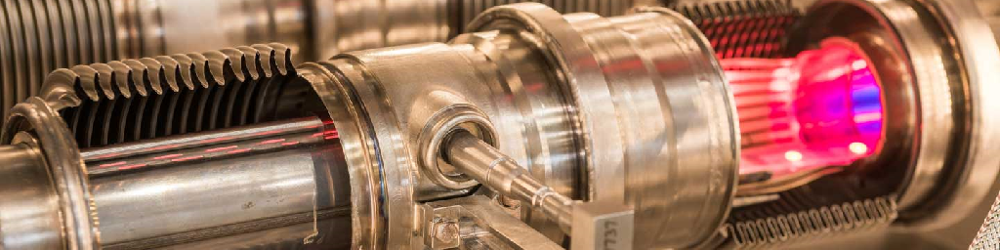

# System Simulation: Brownian Motion

## Build

To build the project, it is necessary to have _Maven +3.5.0_, and
_Java SE 8 Release_ installed. Then, run:

```
$ mvn clean package
```

This will generate a _\*.jar_ in the `target` folder. If you find any issues
with the building, remove the _\*.jar_ files from the _Maven_ local
repository with:

```
$ rm -fr ~/.m2/repository/ar/edu/itba/ss/*
```

Or do it manually, if you prefer.

## Execute

In the root folder (after build):

```
$ java -jar target/tp3-1.0-SNAPSHOT.jar <arguments>
```

Possible arguments are: `generate`, `simulate`.

## Help

```
$ java -jar target/tp3-1.0-SNAPSHOT.jar help
```

## Input Files Format

### `generate` mode

Receives a JSON file with the following format (see example below):

```json
{
	"n"			: "10",
	"events"		: "100",
	"tmax"		: "60.0",
	"l"			: "10.0",
	"r"			: "0.005",
	"speed"		: "0.1",
	"mass"		: "0.0001",
	"rbig"		: "0.05",
	"massbig"	: "0.1",
	"xbig"		: "5.0",
	"ybig"		: "5.0",
	"inputfile"	: "input1.data",
	"outputfile"	: "output1.data",
	"deltat"		: "0.05"
}
```

### `simulate` mode

Receives a JSON file with the following format (see example below):

```json
{
	"events"		: "100",
	"tmax"		: "60.0",
	"l"			: "10.0",
	"inputfile"	: "input1.data",
	"outputfile"	: "output1.data",
	"deltat"		: "0.05"
}
```

## Output File Format

There are different I/O files used. The format and name of each file is listed below:

### Input file  

```
<N>
<x> <y> <r> <vx> <vy> <mass>
...
```

### Output file

* t = 0 comes from the input-file

```
<event-time-1> <id0> ... <idn>
<x> <y> <vx> <vy>
...
```

### Animated file

```
<N>
<t0>
<x> <y>
...
```

### Collisions Frequency file

```
<event-time-0>
<event-time-1>
...
```
### Speed file

```
<speed-1>
<speed-2>
...
```
### Diffusion file

```
<t0> <z0^2>
<t1> <z1^2>
...
```

## Developers

This project has been built, designed and maintained by the following authors:

* [Daniel Lobo](https://github.com/lobo)
* [Agustín Golmar](https://github.com/agustin-golmar)

## Videos

* [Video 1](https://www.youtube.com/watch?v=nPM2uZ0EDr0)
* [Video 2](https://www.youtube.com/watch?v=WNQg-xx5pzw)
* [Video 3](https://www.youtube.com/watch?v=Xg5UGYwZ5G4)
* [Video 4](https://www.youtube.com/watch?v=X0D1JBwEPUE)

## Bibliography

__"Title."__ Authors. _Where & When._
